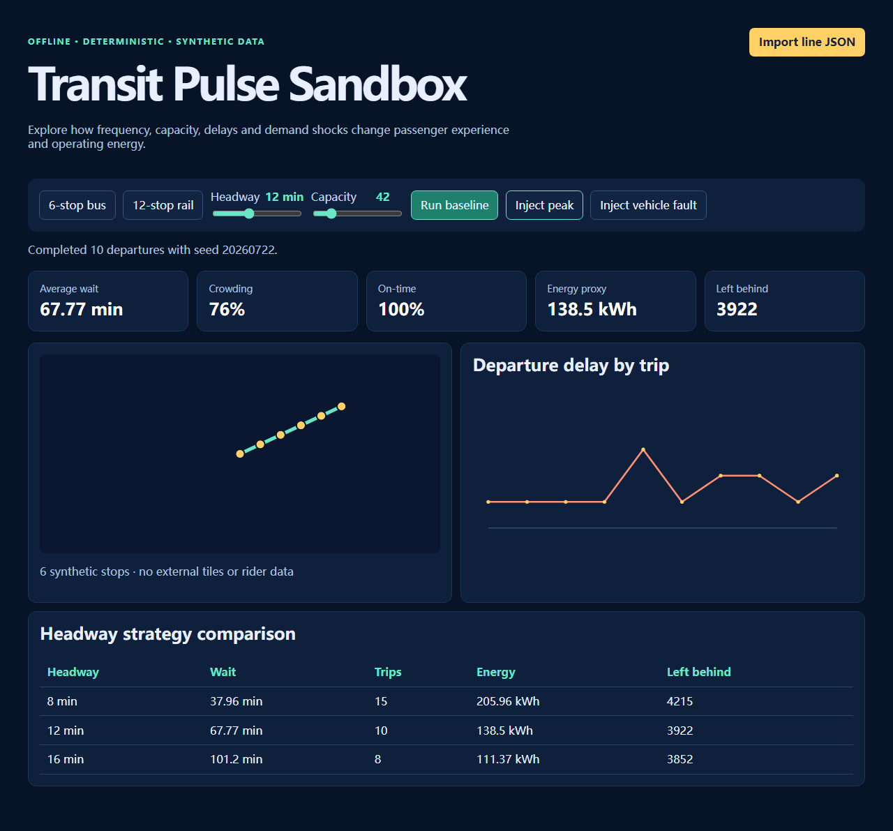

# Transit Pulse Sandbox

[](https://github.com/KanadeK/transit-pulse-sandbox/actions/workflows/ci.yml) [](LICENSE) [](https://github.com/KanadeK/transit-pulse-sandbox/releases)

> **v0.1.0** — an offline, deterministic transit reliability lab for seeing the trade-offs between frequency, crowding, waiting, capacity, delays and an energy proxy.



- Compare headways with the same deterministic demand and delay model.
- Inject a demand peak or vehicle fault and inspect the actual queue and on-time response.
- Import a small local JSON schedule; no data leaves the browser.

```bash
npm ci
npm run dev
```

Open the printed local address, choose the bundled bus or rail line, adjust headway/capacity, and run a scenario.

## What it does

The discrete-event core models passenger arrivals at every stop, per-vehicle capacity, random-but-seeded departure jitter, alighting, a peak multiplier, and a fault delay. It returns average waiting time, crowding ratio, on-time rate, an energy proxy, passenger boardings and passengers left in the queue. The MapLibre route map and D3 delay chart display that returned result; controls do not use precomputed counters.

The repository contains a synthetic 6-stop bus line and a synthetic 12-stop rail line. Both are MIT-licensed as part of this project and can run without network access.

## Real input → output example

```bash
npm run demo
```

This runs the committed 12-stop rail fixture with seed `20260722` and a fixed peak event, then writes a real result to `dist-release/demo-report.json`. The report contains baseline metrics and comparable 6-, 8- and 12-minute strategies; it is generated by `src/core/simulation.ts`, not stored as fixture output.

## Interface and JSON import

`Import line JSON` validates data locally with Zod. A valid input includes a line identifier, mode, positive capacity/distance/travel time, and two or more stops with coordinates and non-negative hourly demand. See [`examples/bus-line.json`](examples/bus-line.json) for the full schema shape.

Useful controls:

- **Run baseline** resets the disruption and calculates a new worker result.
- **Inject peak** applies a 2.5× demand period from minute 30 through 90.
- **Inject vehicle fault** adds a reproducible delay from minute 36 through 72.
- **Headway** and **capacity** change the next run and the live strategy comparison.

## Architecture

The pure, testable domain model lives in `src/core`; file parsing is isolated in `src/adapters`; UI coordination and visual components are in `src/features`; and `src/workers` runs the same domain core outside the rendering thread. Read the fuller [architecture note](docs/ARCHITECTURE.md).

## Install, test and package

Requires Node.js 20.19+.

```bash
npm ci
npm run lint && npm run typecheck && npm run test:coverage && npm run test:e2e && npm run build
npm run package
```

Task entry points:

```bash
make verify
make demo
make package
make release-check
```

On systems without `make`, use the equivalent `npm run` commands above. `npm run package` writes a versioned web ZIP and `SHA256SUMS.txt` to `dist-release/`. `npm run release-check` is deliberately strict: it checks clean Git state, version/changelog, author history, tests, build, package, unfinished markers and common secret patterns.

## Privacy and security

The app has no telemetry, login, remote API, remote map tiles, or real rider data. Imports stay in the browser. See [privacy and security](docs/PRIVACY_AND_SECURITY.md) and [SECURITY.md](SECURITY.md) before using non-synthetic schedules.

## Non-goals

This is not a route planner, fare engine, real-time GTFS consumer, agency-grade demand forecast, or a physical-energy calculation. Energy is an explicitly labeled operational proxy, useful for strategy comparison only.

## Project differentiation

An [open-repository sample scan](docs/COMPETITOR_SCAN.md) found adjacent planning, map, live-data and city-simulation projects, but no same-name highly isomorphic active project. Transit Pulse differentiates through offline synthetic fixtures, transparent fixed-seed experiments, and a narrow single-line reliability decision loop.

## Roadmap

The next milestone is optional GTFS import normalization, multiple-line transfers, and exportable scenario reports while retaining fully local fixtures and deterministic tests.

## Contributing and FAQ

See [CONTRIBUTING.md](CONTRIBUTING.md) and the [Code of Conduct](CODE_OF_CONDUCT.md). Why are the results repeatable? Every random draw comes from a supplied seed. Why are maps plain? The project intentionally avoids external tiles and user-data network requests. Why are results not ridership forecasts? The model uses synthetic demand rates and simplified passenger behavior.
